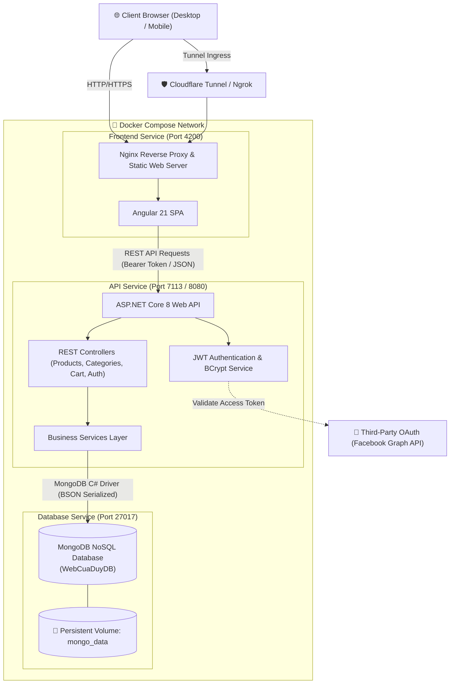
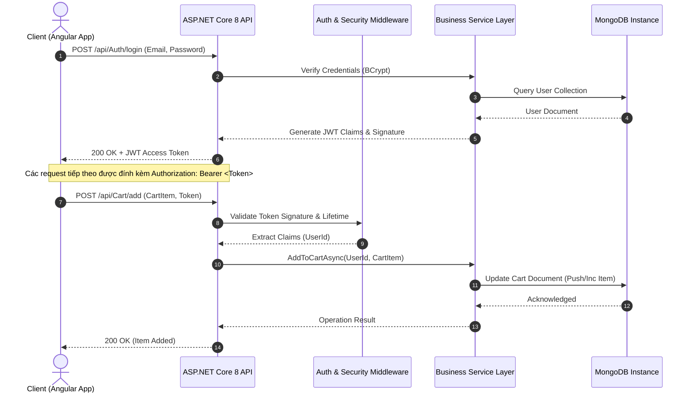
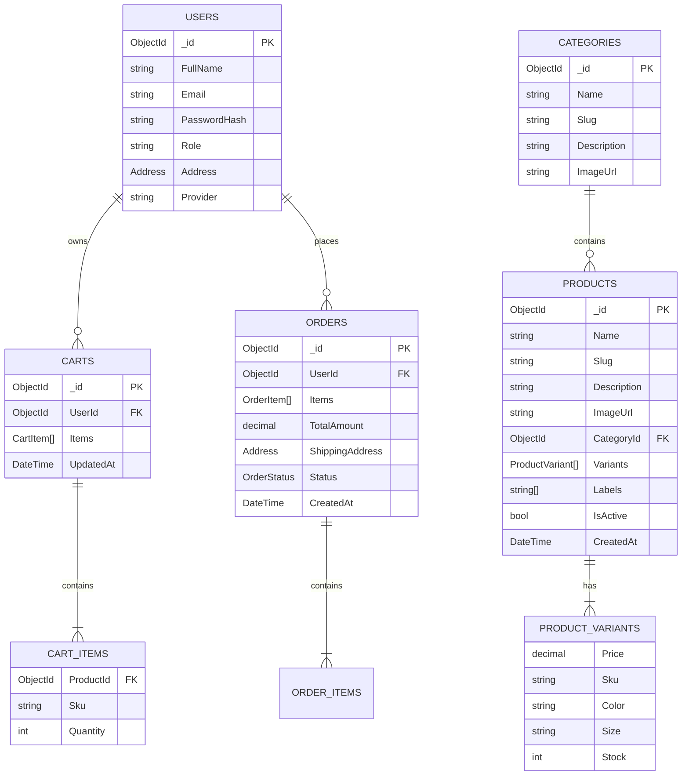

# 🛍️ WebCuaDuy - Modern E-Commerce Fullstack Platform

<div align="center">


<p align="center">
  <strong>Nền tảng thương mại điện tử hiện đại, hiệu năng cao xây dựng trên kiến trúc Multi-Container Micro-Ready với ASP.NET Core 8 Web API, Angular 21 SPA và MongoDB NoSQL.</strong>
</p>

[](https://dotnet.microsoft.com/)
[](https://angular.dev/)
[](https://www.mongodb.com/)
[](https://www.docker.com/)
[](https://tailwindcss.com/)
[](https://getbootstrap.com/)
[](https://swagger.io/)
[](https://opensource.org/licenses/MIT)

</div>

---

## 📑 Mục lục (Table of Contents)

1. [Tổng quan hệ thống (System Overview)](#-tổng-quan-hệ-thống-system-overview)
2. [Kiến trúc kỹ thuật (System Architecture)](#-kiến-trúc-kỹ-thuật-system-architecture)
3. [Tech Stack & Công nghệ cốt lõi](#-tech-stack--công-nghệ-cốt-lõi)
4. [Mô hình dữ liệu (Domain & Data Models)](#-mô-hình-dữ-liệu-domain--data-models)
5. [Tài liệu API Endpoints (API Specifications)](#-tài-liệu-api-endpoints-api-specifications)
6. [Giao diện & Trải nghiệm người dùng (UI/UX Showcase)](#-giao-diện--trải-nghiệm-người-dùng-uiux-showcase)
7. [Cấu trúc thư mục (Directory Structure)](#-cấu-trúc-thư-mục-directory-structure)
8. [DevOps & Containerization](#-devops--containerization)
9. [Hướng dẫn cài đặt & Khởi chạy (Getting Started)](#-hướng-dẫn-cài-đặt--khởi-chạy-getting-started)
   - [Phương pháp 1: Docker Compose (Khuyên dùng)](#cách-1-triển-khai-nhanh-với-docker-compose-production-like)
   - [Phương pháp 2: Local Development (Manual Setup)](#cách-2-chạy-từng-service-cho-quá-trình-phát-triển-local-dev)
10. [Bảo mật & Tối ưu hiệu năng (Security & Performance)](#-bảo-mật--tối-ưu-hiệu-năng-security--performance)
11. [Kế hoạch phát triển (Roadmap)](#-kế-hoạch-phát-triển-roadmap)

---

## 🌟 Tổng quan hệ thống (System Overview)

**WebCuaDuy** là giải pháp phần mềm E-Commerce Fullstack toàn diện, được thiết kế theo tư duy kiến trúc hiện đại, chú trọng vào:
- **Tách biệt mối quan tâm (Separation of Concerns)**: Frontend Single Page Application (Angular) hoàn toàn độc lập với Backend RESTful API (.NET 8).
- **Linh hoạt cấu trúc dữ liệu (Schemaless Flexibility)**: Sử dụng MongoDB kết hợp BSON Serializer trong .NET giúp quản lý sản phẩm đa biến thể (variants, SKU, sizes, colors, attributes) một cách tự nhiên và tối ưu truy vấn.
- **Đóng gói chuẩn hóa (Containerized Workflow)**: Multi-stage Docker builds tối ưu kích thước image và tài nguyên, sẵn sàng triển khai trên bất kỳ môi trường đám mây hoặc máy chủ on-premise nào.

---

## 🏗 Kiến trúc kỹ thuật (System Architecture)

### 1. Sơ đồ khối tổng thể (High-Level Topology)



### 2. Luồng xử lý yêu cầu (Request-Response Flow)



---

## 🛠 Tech Stack & Công nghệ cốt lõi

| Tầng (Layer) | Công nghệ | Phiên bản | Chi tiết kỹ thuật & Thư viện |
| :--- | :--- | :--- | :--- |
| **Backend** | **ASP.NET Core Web API** | `8.0` (LTS) | <ul><li>`MongoDB.Driver` (v3.5.2) cho tương tác CSDL NoSQL</li><li>`Microsoft.AspNetCore.Authentication.JwtBearer` bảo mật API</li><li>`BCrypt.Net-Next` mã hóa mật khẩu an toàn (Salt & Hash)</li><li>`Swashbuckle.AspNetCore` (v6.6.2) sinh OpenAPI spec & Swagger UI</li><li>Dependency Injection (IoC Container)</li><li>Cross-Origin Resource Sharing (CORS) Policy</li></ul> |
| **Frontend** | **Angular SPA** | `21.0` | <ul><li>Kiến trúc Component-Driven & Standalone Components</li><li>`Tailwind CSS` (v4.1) & PostCSS utility-first styling</li><li>`Bootstrap 5.3` & `Bootstrap Icons`</li><li>`RxJS` Reactive Programming & Subscriptions</li><li>`Angular Router` với Nested/Child Routes cho Admin & Client</li><li>`HttpClient` + HttpInterceptors</li></ul> |
| **Database** | **MongoDB** | `Latest` | <ul><li>NoSQL Document-oriented Store</li><li>BSON ObjectIds, Embedded Documents (Variants, Addresses, OrderItems)</li><li>Persistent Data Volume mapping</li></ul> |
| **DevOps & Web Server** | **Docker & Nginx** | Alpine | <ul><li>Multi-stage Dockerfile cho .NET (SDK 8.0 build -> Runtime 8.0)</li><li>Multi-stage Dockerfile cho Angular (Node 20 Alpine -> Nginx Alpine)</li><li>Docker Compose Orchestration</li><li>Nginx Reverse Proxy với SPA Fallback Routing (`try_files`)</li></ul> |

---

## 📊 Mô hình dữ liệu (Domain & Data Models)

Hệ thống tận dụng tính linh hoạt của MongoDB Document Database, kết hợp cấu trúc dữ liệu phẳng và lồng nhau (Embedded Subdocuments):



---

## 🔌 Tài liệu API Endpoints (API Specifications)

Backend cung cấp hệ thống REST API hoàn chỉnh, tài liệu hóa tự động qua **Swagger UI** tại `/swagger`.

### 🔐 1. Authentication (`/api/Auth`)
| Phương thức | Endpoint | Yêu cầu Auth | Mô tả |
| :--- | :--- | :---: | :--- |
| `POST` | `/api/Auth/register` | ❌ | Đăng ký tài khoản người dùng mới (Băm mật khẩu bằng BCrypt) |
| `POST` | `/api/Auth/login` | ❌ | Xác thực email/mật khẩu, trả về JWT Bearer Token |
| `POST` | `/api/Auth/facebook-login` | ❌ | Đăng nhập bằng Facebook Access Token qua OAuth Graph API |

### 📦 2. Products Management (`/api/Product`)
| Phương thức | Endpoint | Yêu cầu Auth | Mô tả |
| :--- | :--- | :---: | :--- |
| `GET` | `/api/Product` | ❌ | Lấy danh sách tất cả sản phẩm kèm biến thể và danh mục |
| `GET` | `/api/Product/{id}` | ❌ | Lấy chi tiết thông tin sản phẩm theo MongoDB ObjectId |
| `POST` | `/api/Product` | ❌ | Tạo mới sản phẩm kèm biến thể (SKU, giá, size, màu) |
| `PUT` | `/api/Product/{id}` | ❌ | Cập nhật thông tin chi tiết sản phẩm |
| `DELETE` | `/api/Product/{id}` | ❌ | Xóa sản phẩm khỏi hệ thống |

### 📂 3. Category Management (`/api/Categories`)
| Phương thức | Endpoint | Yêu cầu Auth | Mô tả |
| :--- | :--- | :---: | :--- |
| `GET` | `/api/Categories` | ❌ | Lấy danh sách toàn bộ danh mục sản phẩm |
| `POST` | `/api/Categories` | ❌ | Tạo mới danh mục sản phẩm |
| `DELETE` | `/api/Categories/{id}` | ❌ | Xóa danh mục theo ObjectId |

### 🛒 4. Cart Engine (`/api/Cart`)
| Phương thức | Endpoint | Yêu cầu Auth | Mô tả |
| :--- | :--- | :---: | :--- |
| `GET` | `/api/Cart` | 🔒 `Bearer` | Lấy danh sách sản phẩm trong giỏ hàng của User hiện tại |
| `POST` | `/api/Cart/add` | 🔒 `Bearer` | Thêm sản phẩm và biến thể (SKU) vào giỏ hàng |
| `DELETE` | `/api/Cart/remove` | 🔒 `Bearer` | Xóa sản phẩm/SKU khỏi giỏ hàng |

---

## 🎨 Giao diện & Trải nghiệm người dùng (UI/UX Showcase)

Hệ thống được thiết kế với phong cách hiện đại, responsive hoàn hảo trên mọi kích thước màn hình:

| Trang chủ & Hero Showcase | Lookbook & Bộ sưu tập thời trang |
| :---: | :---: |
|  |  |

| Chi tiết sản phẩm & Biến thể SKU | Dashboard Quản trị Admin |
| :---: | :---: |
|  | *Quản lý danh mục, biến thể và sản phẩm trực quan* |

---

## 📂 Cấu trúc thư mục (Directory Structure)

```text
ecommerce-fullstack-Duy/
├── docker-compose.yml              # Điều phối Multi-container (Mongo, .NET API, Angular Nginx)
├── WebCuaDuy.sln                   # Visual Studio Solution File
│
├── WebCuaDuy/                      # 🚀 BACKEND (.NET 8 WEB API)
│   ├── Controllers/                # API Endpoints (Auth, Products, Categories, Cart)
│   │   ├── AuthController.cs       # Đăng ký, đăng nhập JWT, Facebook OAuth
│   │   ├── ProductsController.cs   # CRUD sản phẩm & biến thể
│   │   ├── CategoriesController.cs # Quản lý danh mục
│   │   └── CartController.cs       # Xử lý giỏ hàng định danh theo User Claim
│   ├── Entities/                   # Domain Entities & MongoDB BSON Document Models
│   │   ├── Product.cs              # Product model (BsonId, Variants, Labels)
│   │   ├── Category.cs             # Category model
│   │   ├── User.cs                 # User identity model
│   │   ├── Cart.cs                 # Cart aggregate model
│   │   ├── Oder.cs                 # Order snapshot model
│   │   └── SharedEntities.cs       # Address, ProductVariant, CartItem, OrderStatus
│   ├── DTOs/                       # Data Transfer Objects (LoginRequest, RegisterRequest)
│   ├── Services/                   # Business Logic Layer & MongoDB Repositories
│   │   ├── ProductService.cs
│   │   ├── CategoryService.cs
│   │   ├── CartService.cs
│   │   └── UserService.cs
│   ├── Dockerfile                  # Multi-stage build cho .NET 8 API
│   ├── Program.cs                  # Dependency Injection, CORS, JWT, Swagger setup
│   └── appsettings.json            # Cấu hình JWT, MongoDB Connection Strings
│
└── Client/                         # ⚡ FRONTEND (ANGULAR 21 SPA)
    ├── src/
    │   ├── app/
    │   │   ├── components/         # Giao diện Component-driven
    │   │   │   ├── admin/          # Admin Layout, Product & Category Management
    │   │   │   ├── hero-banner/    # Hero banner quảng bá
    │   │   │   ├── new-arrivals/   # Danh sách hàng mới về
    │   │   │   ├── lookbook/       # Lookbook phối đồ thời trang
    │   │   │   ├── product-list/   # Danh sách và bộ lọc sản phẩm
    │   │   │   ├── product-detail/ # Chi tiết sản phẩm, chọn SKU/Màu/Size
    │   │   │   ├── quick-add/      # Modal mua hàng nhanh
    │   │   │   ├── login/          # Đăng nhập / Đăng ký
    │   │   │   └── home/           # Trang chủ tổng hợp
    │   │   ├── services/           # ApiService, AuthService, ProductService, CartService
    │   │   ├── Models/             # TypeScript Interfaces & Types
    │   │   ├── app.routes.ts       # Định tuyến SPA & Phân quyền Admin
    │   │   └── app.config.ts       # Application Configuration
    │   ├── index.html              # Single Page HTML Root
    │   └── styles.css              # Global styles & Tailwind Directives
    ├── nginx.conf                  # Nginx Web Server Configuration & SPA fallback
    ├── Dockerfile                  # Multi-stage build (Node.js 20 -> Nginx Alpine)
    ├── angular.json                # Angular CLI configuration
    └── package.json                # NPM Dependencies & Scripts
```

---

## 🐳 DevOps & Containerization

Hệ thống được tối ưu với quy trình đóng gói container nhiều giai đoạn (**Multi-Stage Builds**), giúp:
1. **Giảm thiểu kích thước Image**: Tách biệt môi trường build (SDK/Node) và môi trường runtime (ASP.NET Runtime / Nginx Alpine siêu nhẹ).
2. **Bảo mật**: Không để lộ mã nguồn gốc và build tools trong production container.
3. **Reproducible Builds**: Đảm bảo ứng dụng chạy đồng nhất trên mọi máy chủ.

### Cấu hình cổng và dịch vụ trong `docker-compose.yml`:

| Service | Container Name | Base Image | Port Mapping | Chức năng |
| :--- | :--- | :--- | :--- | :--- |
| **`db`** | `mongodb_duy` | `mongo:latest` | `27017:27017` | NoSQL Database Engine, mount volume `mongo_data` |
| **`api`** | `backend_api` | `.NET 8 Runtime` | `7113:8080` | REST API Engine kết nối trực tiếp đến container `db` |
| **`web`** | `angular_web` | `nginx:alpine` | `4200:80` | Phục vụ Client SPA và xử lý định tuyến URL |

---

## 🚀 Hướng dẫn cài đặt & Khởi chạy (Getting Started)

### Yêu cầu tiên quyết (Prerequisites)
- [Git](https://git-scm.com/)
- [Docker Desktop](https://www.docker.com/products/docker-desktop/) (Đã bật tính năng Virtualization trong BIOS / WSL2)
- *(Tùy chọn nếu dev thủ công)*: [.NET 8.0 SDK](https://dotnet.microsoft.com/download/dotnet/8.0), [Node.js 20+ (LTS)](https://nodejs.org/), [MongoDB Community Server](https://www.mongodb.com/try/download/community)

---

### Cách 1: Triển khai nhanh với Docker Compose (Production-like)

Chỉ với **1 câu lệnh duy nhất**, toàn bộ cơ sở dữ liệu MongoDB, Backend API và Frontend Nginx sẽ được build và khởi chạy đồng bộ:

```bash
# 1. Clone repository
git clone https://github.com/duyhai020703/ecommerce-fullstack-Duy.git
cd ecommerce-fullstack-Duy

# 2. Build và khởi chạy toàn bộ các dịch vụ dưới nền
docker-compose up --build -d
```

#### 🌐 Địa chỉ truy cập các dịch vụ:
- **Frontend Web UI**: [`http://localhost:4200`](http://localhost:4200)
- **Backend Swagger API Docs**: [`http://localhost:7113/swagger`](http://localhost:7113/swagger)
- **MongoDB Connection URI**: `mongodb://localhost:27017/WebCuaDuyDB`

#### 🛑 Dừng hệ thống:
```bash
docker-compose down
```

---

### Cách 2: Chạy từng service cho quá trình phát triển (Local Dev)

#### Bước 1: Khởi động Database (MongoDB)
Khởi chạy MongoDB cục bộ qua Docker hoặc MongoDB Service:
```bash
docker run -d -p 27017:27017 --name mongodb_local mongo:latest
```

#### Bước 2: Chạy Backend .NET API
```bash
cd WebCuaDuy
dotnet restore
dotnet run
# Hoặc chế độ Hot-Reload:
dotnet watch run
```
> API sẽ chạy tại: `https://localhost:7113` hoặc `http://localhost:5000`

#### Bước 3: Chạy Frontend Angular SPA
```bash
cd Client
npm install --force
npm start
```
> Ứng dụng sẽ chạy tại: `http://localhost:4200`

---

## 🔒 Bảo mật & Tối ưu hiệu năng (Security & Performance)

- **JWT Stateless Authentication**: Phân quyền người dùng dựa trên Claims, tự động xác thực chữ ký số và thời hạn token (Token Lifetime).
- **Mã hóa một chiều BCrypt**: Đảm bảo mật khẩu người dùng không bao giờ được lưu dưới dạng plain-text.
- **CORS Restricted Policy**: Kiểm soát nguồn gốc request, hạn chế truy cập trái phép từ các domain ngoài danh sách cấp phép.
- **Nginx SPA Routing & Static Caching**: Cấu hình Nginx fallback `try_files $uri $uri/ /index.html` đảm bảo Angular HTML5 pushState routing hoạt động mượt mà không bị lỗi 404 khi tải lại trang.
- **BSON Decimal128**: Chuẩn hóa kiểu dữ liệu tiền tệ để tránh lỗi làm tròn số thực trong giao dịch thương mại.

---

## 🗺️ Kế hoạch phát triển (Roadmap)

- [ ] Tích hợp Cổng thanh toán trực tuyến (VNPay / MoMo / Stripe).
- [ ] Xây dựng hệ thống Refresh Token & Blacklist Token với Redis.
- [ ] Gửi thông báo đơn hàng thời gian thực qua WebSockets / SignalR.
- [ ] Full-text Search sản phẩm nâng cao với ElasticSearch.
- [ ] Thiết lập CI/CD Pipeline tự động qua GitHub Actions.

---

## 👤 Tác giả & Đóng góp (Author & License)

- **Author**: Nguyễn Hải Duy
- **GitHub**: [@duyhai020703](https://github.com/duyhai020703)
- **Dự án**: [ecommerce-fullstack-Duy](https://github.com/duyhai020703/ecommerce-fullstack-Duy)
- **Giấy phép**: Phát hành theo giấy phép [MIT License](LICENSE).
